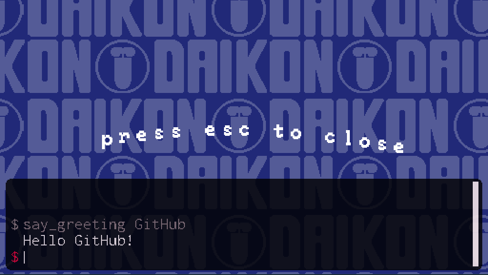

# rt-shell
rt-shell, or **r**un-**t**ime **shell** an easy-to-use, customizable, and extensible cheat/debug console for GameMaker Studio 2.3+.

## Setup

Integrating rt-shell into your project is simple: just [download the latest release](https://github.com/daikon-games/rt-shell/releases), and then in GameMaker Studio click on the **Tools** menu and select **Import Local Package**. Choose the `.yymps` file you downloaded, and import all assets.

The `obj_shell` object is a persistent object, so you only need to include or create it once, though it is smart enough to automatically handle excess instances. The default way to open the shell is `Ctrl + Shift + C`, and it can be closed by pressing `Esc`.

## Customization

The following variables on the `obj_shell` object can be customized. They are defined on the object's `Variable Definitions` panel in the IDE, so you can change them on the object itself, an instance of the object in the room editor, or at any point after that programatically.

| variable | definition | default |
|----------|------------|---------|
| `width`  | The width, in GUI pixels, of the shell | 500 |
| `height` | The height, in GUI pixels, of the shell | 96 |
| `prompt` | A character or string to print as a command prompt | $ |
| `promptColor` | The font color to draw the prompt, as a GML expression | `make_color_rgb(237, 0, 54)` |
| `openKey` | The key that opens the console, in combination with the `modifierKeys` if any. Must be a valid character that can be decoded with [`ord()`](https://docs2.yoyogames.com/source/_build/3_scripting/4_gml_reference/strings/ord.html) (typically the capital letters) | C |
| `modifierKeys` | A multi-select of special keys. All the selected keys must be pressed in combination with `openKey` to open the console | `vk_control`, `vk_shift` |
| `consoleColor` | The background color of the console itself, as a GML expression | `c_black` |
| `consoleAlpha` | The opacity of the console itself, 0.0 being fully transparent and 1.0 being fully opaque | 0.9 |
| `consoleFont` | The GML font resource to draw all the console text with. The default is included with the package, and uses the Raph Levien's "Inconsolata" font | `font_console` |
| `fontColor` | The font color to draw all console text with, as a GML expression | `make_color_rgb(255, 242, 245)` |
| `fontColorDark` | The font color to draw suggestions and history with, as a GML expression | `make_color_rgb(140, 118, 123)` |
| `screenAnchorPoint` | The location on the screen to anchor the console to, as a string. Possible values are `"top"` or `"bottom"`. | `"bottom"` |

You can see examples of various customizations on the [Theme Gallery](THEMING.md) page!

## Writing Your Own Shell Scripts

rt-shell will execute any global scripts whose names start with `sh_`. You can see the example scripts included with the test project in [`scr_shell_scripts.gml`](rt-shell/scripts/scr_shell_scripts/scr_shell_scripts.gml).

Let's write a simple "Hello World" script together. We first need a place to create the function, so create a Script asset in your project. The name of this asset isn't important, but we can call it `scr_shell_scripts` as I have done in the test project.

Now let's write our function! We want it to take an argument as input, and print "Hello [argument]!" to the console. Like so:



Our function needs to start with `sh_`, so let's call it `sh_helloworld`. As you can see in the example screenshot above, you do not include the `sh_` when calling the function.

rt-shell functions take an array called `args` as an argument, and any arguments passed to the function at the console are present in this array in GML. `args[0]` always contains the name of the function, as in typical shell programming, and `args[1]` and onwards are the real arguments passed in.

rt-shell functions can optionally return a string, and if they do that string will be printed to the console.

With all that said, here's our final hello world function:

```
function sh_helloworld (args) {
	return "Hello " + args[1] + "!";
}
```

Simple, right? With that function in place, you can call `helloworld` from the shell as you saw in the screenshot above. I'm sure you can think of all sorts of scripts that would come in handy for debugging and testing your game. How about a script that set's the player's max health, or money counter? A script that spawns an enemy or a treasure item? Experiment and have fun, and most importantly happy developing!
